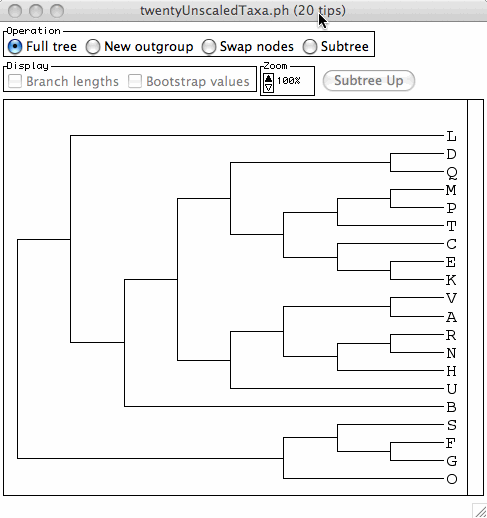

#Interpreting Molecular Phylogenetic Trees  
####EMBO Practical Course on Computational Molecular Evolution  
####Institute of Marine Biology, Biotechnology and Aquaculture (IMBBC) - Hellenic Centre for Marine Research (HCMR), Heraklion, Greece  
####Monday May 5th 2014
####Aidan Budd

##Phylogeny Terminology and Concepts

###Notes

This exercise focuses on how we understand vocabulary and concepts associated with phylogenies and molecular evolution. By asking you to write down and discuss you understanding of several fundamental concepts and terms used in the field, the aim is to help highlight:

- the diversity amongst course participants, of our understanding of these different terms and concepts
- assumptions we make concerning these terms and concepts

It has been shown that considering an issue in several different ways e.g. (i) silently on your own (ii) in direct discussion with others or (iii) in a larger group discussion) tends to reinforce our ability to benefit from a given learning experience. Hence the structure of the exercise provided below.

###Exercise

A. Write down definitions/descriptions of the terms given in the list below (1-3).

Do this silently, on your own, and please actually write it down (on paper, or in a document on your computer) - formulating your ideas into words like this helps highlight aspects of the topic where your ideas are less clear (i.e. in this case, the parts of the definitions you find hardest to write are those which you feel less confident about)

It might help to begin by looking at the [Wikipedia page for phylogenetic trees](http://en.wikipedia.org/wiki/Phylogenetic_tree). If you do begin by consulting this page, please close the page when you write your own definitions/explanations of these terms, so that you don't find yourself just repeating what's already in the Wikipedia page.

Here are the terms:

1. phylogenetic tree
1. branch (of a phylogenetic tree)
1. root (of a rooted phylogenetic tree)

B. Once you've finished, compare your definitions with those of your neighbours.

Make notes on how your definitions differ, and write together a definition that agrees with both your ideas of the meaning of these terms.

C. We'll compare the definitions you have written together with [definitions we prepared before coming to the class](#SuggestedPhylogenyDefinitions) - we'll discuss together any ways in which these pre-prepared definitions differ with the ones you have come up with.

D. (If you quickly finish part A. of the exercise) Repeat the above steps, this time selecting two or more terms from the list below.

4. node (of a phylogenetic tree)
4. polytomy
4. sister group
4. subtree
4. taxonomic unit

If you're interested, you could consult these [definitions/explanations Alexis and I have written for these terms](./documents/phyloTerminologyTakenFromWileyDictionary.pdf).

###Suggested Definitions

**phylogenetic tree**: A description of a path of transmission of genetic information between a set of taxo.  
**branch** (of a phylogenetic tree): Lineages of taxonomic units that link nodes within a phylogenetic tree.  
**root** (of a rooted phylogenetic tree): In a rooted tree, the node that represents the most recent common ancestor taxon of all other taxa in the tree.  

##Visualising Trees with NJplot

###Learning Objectives

After completing this section, you will hopefully be able to use NJplot to change the way a phylogenetic tree is visualised/drawn by the software by changing the root and rotating subtrees around internal branches to reach a specified/desired representation of a tree.

###Notes

Many applications of phylogenies involve using them to check whether a given set of taxa/organisms/OTUs are related to each other in a particular way i.e. whether the topology of the estimated phylogeny supports a particular set of relationships between OTUs. As a tree with a given topology can be drawn/represented/visualised in many different ways, it can sometimes be tricky to tell whether a given representation of a phylogenetic tree indeed contains the relationship of interest. Thus, working with and changing between different representations of a tree is a useful skill when interpreting the results of phylogenetic analyses.

NJplot does not have many features and options, however it carries out the simple tasks of re-rooting and rotating branches - very useful when attempting to determine whether a given set of relationships exists in a tree, or when comparing to tree topologies - very quickly, which is often all you need when taking a first look at a phylogeny.

This page describes how to carry out these kinds of manipulations using NJplot - we will also demo them for you.

###Exercise

Load the following NEWICK/PHYLIP format [unscaled phylogenetic file](./trees/eightTaxaUnscaledNjplotExercise.ph) into NJplot and use the software to try and reproduce as closely as possible the following image:

If the previous exercise was easy, try the same thing with the following [tree file](./trees/twentyUnscaledTaxaNjplotExercise.ph) and image:

