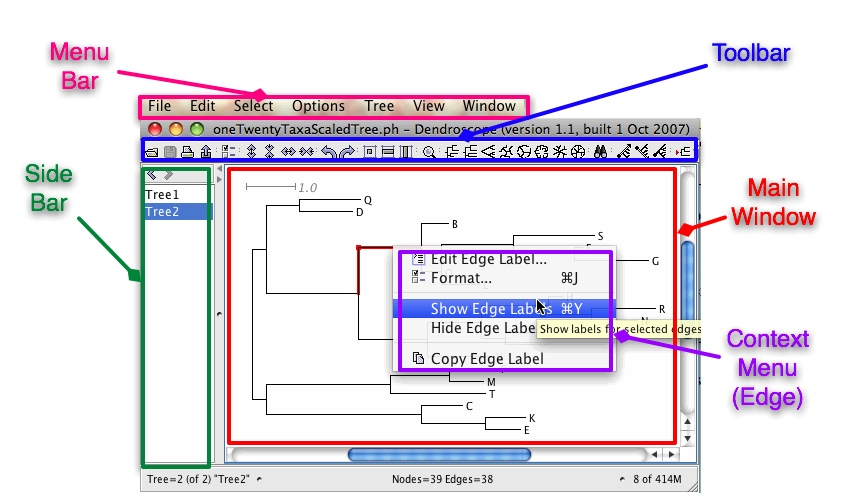
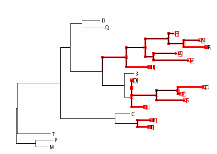
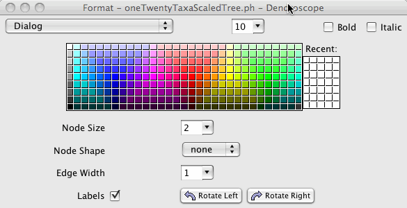
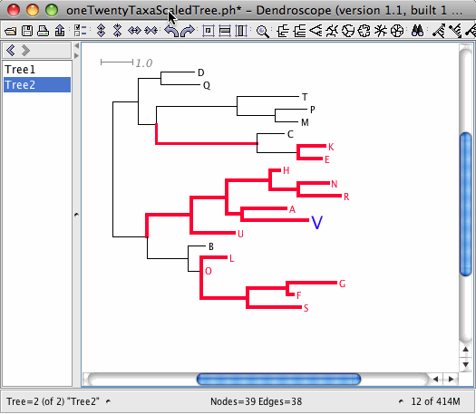
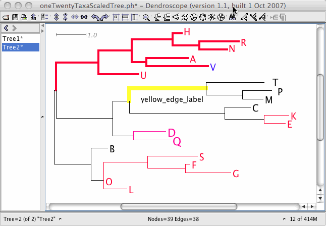
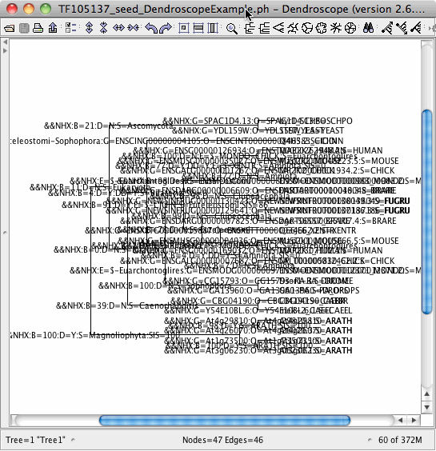
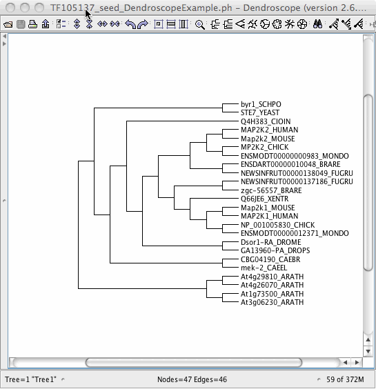
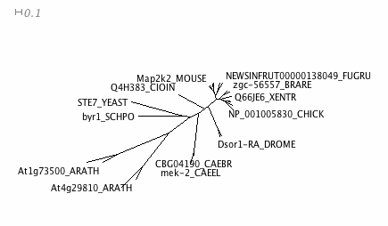
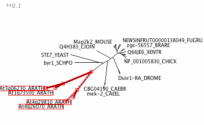
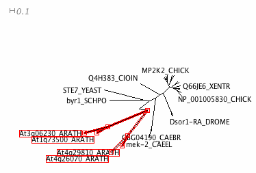

Using Dendroscope
==================

## Introduction

Dendroscope is a phylogenetic tree viewer. Thus, it is not designed to estimate trees, or to alter/edit the topologies of already-estimated
trees.

The software can [be downloaded from](http://www-ab.informatik.uni-tuebingen.de/software/dendroscope/welcome.html) the University of Tuebingen, Germany, where it is developed. The software is available for all three major operating systems. For more information, check out the [2007](http://www.biomedcentral.com/1471-2105/8/460) and [2012](http://sysbio.oxfordjournals.org/content/early/2012/09/24/sysbio.sys062) articles describing the software.

## File formats accepted by Dendroscope

### NEWICK/PHYLIP format

Dendroscope can display trees where edges are labeled using square brackets i.e. [...]. For example, the following tree has the label "mammals" attached to the internal branch grouping the mouse and human OTUs  
 
`((human,mouse)[mammals],frog);`

Indeed, after adding labels to branches of a tree using Dendroscope, the software uses square brackets in exactly this way if you export the tree in NEWICK format.

However, Dendroscope **cannot display trees where the implicit branch ancestral to the root** is labeled in this way. For example, the following tree would not open in Dendroscope, due to the [tetrapods] label at the root.

`((human,mouse)[mammals],frog)[tetrapods];`

Therefore, NEWICK format trees imported from other sources may need to be edited before they can be viewed in Dendroscope - for example, trees
exported from TreeFam have the root labeled in this way - this must be removed before the tree is examined in Dendroscope.

#### Example files

##### NEWICK format

[This is an example of a NEWICK format file](./trees/TF105137_seed_DendroscopeExample.ph) that can be read by Dendroscope. The tree was obtained from TreeFam (and edited as described above to be readable by Dendroscope)

[This is an example of a large NEWICK format file](./trees/TF105088_full_large800plusLeavesEd.ph), with more than 800 terminal nodes. It too was retrieved and slightly modified from TreeFam.

##### Dendroscope format

After making changes to the way a tree is represented in Dendroscope, you can save a file in native Dendroscope format. When opened by
Dendroscope, this file will show the same tree that you saved with the same formating etc. as when you saved it.

[This is an example of a Dendroscope format file.](./trees/TF105137_seed_ExampleDendroFormat.dendro)

## Dendroscope Graphical User Interface (GUI)

The graphical user interface (GUI) for Dendroscope should look similar to the image shown below. The following components of the GUI are labeled

- the Main Window - where the phylogeny/tree is viewed
- the Menu Bar - providing a range of different options to manipulate the view of the phylogeny
- the Side Bar - provides a list of all the trees present in the current file
- the Toolbar - provides short-cuts to several of the more commonly-used menu items
- Context Menus - right mouse-click on different regions of the screen to obtain additional options applied to the selected region
 - nodes
 - edges
 - background (allows selection of all edges/nodes/labels)

**Note: The above description was for a version before the November 2013 release; while similar, the November 2013 release doesn't include the side bar, but adds an additional "messages" window that provides information on the commands issued by us to Dendroscope**

### Opening a File

There is more than one way to open a file\

- *File -> Open*
- Use the "Open Tree File" icon 

and then select file to be opened using you operating system's menus

**Note: in the November 2013 version, I am unable to open any tree file that does not have the name ending ".txt"; thus, if trying to load a tree from a file with a different name ending, rename (or make a new copy of) the file to add ".txt" to the end of it e.g. if your file is named "TF105137_seed_DendroscopeExample.ph" you could rename it to "TF105137_seed_DendroscopeExample.ph.txt" and Dendroscope should be able to load it** 

### Displaying Taxa Labels - IMPORTANT!

To help present a large phylogeny in an uncluttered way, by default Dendroscope chooses to hide from view many of the taxa labels on a tree
(where the labels would be overlapping and thus difficult to read) - this is controlled by the option:\
 *View -> Sparse Labels*

However, if you are searching for a taxon-label corresponding to a particular sequence of interest, this can be problematic: the label you
are looking for may have been hidden by Dendroscope.

Therefore, you will often want to switch off this option by simply selecting the *View -> Sparse Labels* option (if there is a tick after the option, then labels are being hidden)

**Note: Above instructions still work for November 2013 version**

### Switching Between Different Tree Representations

There are two ways of doing this:

- Choosing the appropriate "Tree Representation" icon from the toolbar   
    **Note: This still works for November 2013 version**
- Use the Tree menu  
    **Note: In November 2013 version, these are now in the "Layout" rather than the "Tree" menu**

##### Rooted, scaled tree representation

To view a tree so that it is shown with a root, and with branch-length information **included** in the representation, do one of the following:
- *Tree -> Draw Rectangular Phylogram* (i.e. using the "Tree" menu) 
- Choose the  Toolbar icon

##### Rooted, unscaled tree representation

This is the default representation on some versions of Dendroscope. To view a tree so that it is shown with a root, but with branch-length information ignored in the representation, do the following:

- *Tree -> Draw Rectangular Cladogram* (i.e. using the "Tree" menu)
- Choose the  Toolbar icon

##### "Typical" unrooted representation

-   *Tree -> Draw Radial Phylogram* (i.e. using the "Tree" menu)
-   Choose the  Toolbar icon

### Selecting Branches/Nodes

Depending on the number of left mouse-clicks you give to a branch/node you can select

-   one click - only the clicked-on branch
-   two clicks - the entire clan/subtree associated with one end of the branch (including branches, nodes, and labels)
-   three clicks - the entire clan/subtree associated with the other end of the branch (including branches, nodes, and labels)

Multiple branches/nodes/labels can be selected/de-selected by left
mouse-clicking while holding the SHIFT key. The image below shows
several branches, nodes, and labels highlighted.

**Note: In November 2013 version, these instructions are still valid, although they seem to be somewhat erratic i.e. I may have to try 10 times before the double or triple click does what I want**

### Reroot Tree

Left-click with the mouse on the **branch** or **node** you want to place the root on to select it and then either:

-   Select the "Reroot tree" Toolbar icon 
-   *Edit -> Reroot*
-   *Shift - Control (or cmd on Mac) - R*

**Note: This still works for November 2013 version**

### Rotate Branches Around a Node

To rotate branches (which does not change the topology of the tree, only the way it is represented)

Left-click with the mouse on the **node** (doesn't work i.e. won't let you choose to "Swap Subtree etc. if you select a branch instead of a node!) you want to rotate around to select it and then either:

-   Select the "Swap order of subtrees below node" Toolbar icon 
-   *Edit -> Swap Subtree*
-   Right-click to obtain the node Context Menu and choose *"Swap Subtree"*
-   *Control (or cmd on Mac) - T*

**Note: This still works for November 2013 version**

### Formatting Branches and Nodes

To change the colour/thickness/font etc. of selected
nodes/branches/labels do:

- *Edit -> Format*
- *Control (or cmd on Mac) - J*

This brings up the "Format" window shown below

From here you can, for example:

- change the width of branches by altering the "Edge Width"
- change the colour of the selected nodes/branches/labels by clicking on the colour pallet to choose the appropriate colour
- change the size of the text used for the labels using the middle-top menu-box (above this contains the number "10")

See the image below for an example of such editing.

**Note: This still works for November 2013 version**

### Adding Labels to Branches

It is possible to add text-labels to branches - for example to supply the name of a clade - e.g. vertebrates - associated with a particular group:

-   Select branch(es) of interest
-   Right-click to get access to the Branch Context Menu
    - **Note: In November 2013 version this this also works with left-click and Ctrl**
-   Choose "Edit Edge Label" to provide a text-label for the branch - any gaps in your text will be substituted by "_" characters on the label

For example, the image below has a label added to the thick yellow
branch.

### Adjusting Positions of Labels

By simply left-clicking with the mouse and dragging it is possible to change the position of any of the labels (either branch labels as above, or the taxa labels at the end of branches. These labels remain attached to their branches and will move accordingly following rearrangements of the tree.

**Note: This still works for November 2013 version**

### Adding a scale bar

Using a "text" command:

- Window -> Execute Command
    - **Note: in November 2013 version this is Window -> Command input**
- Type "set scalebar=true" and press Return
- Click "Apply"

Using a menu item:

- *View -> Show scale bar*
    - **Note: This seems to be an addition for November 2013 or some other version more recent than the one these instructions were originally written for**

### Saving a Tree Representation

You can save the representation of your tree in a format that is read only by Dendroscope - this file can be reloaded into Dendroscope at a later date, and will have exactly the same set of rearrangements and formating as the trees in Dendroscope when the file was saved. You can do this using either of:

-   *File -> Save*
-   *File -> Save As...*

If you are looking to save the image for use in preparing a figure, then use *File -> Export Image* and save the file in either EPS  or SVG format (to maintain it as a set of vectors rather than reducing it to a set of pixels as the other formats do)
 
The resulting file can then be loaded into a range of different
software such as Adobe Illustrator to prepare a file version of a figure for publication/presentation.

**Note: This still works for November 2013 version**

### Hiding Branch/Edge Annotations/Labels

Trees obtained from some sources, such as [TreeFam](http://www.treefam.org/), have information annotated/associated with tree branches that can sometimes make the shape, and other features, of the tree difficult to read/interpret. Thus, if we're not interested in reading this information, we usually turn off the representation of this information using the "View" menu:

-   View -> Hide Edge Labels

**Note: for November 2013 version, you need to firstly select (e.g. with *Ctrl (or cmd on mac) - A* or *Select -> Select all*) the branches/edges you want to remove labels from, and then uncheck ***View -> Show edge labels*** **

Below is an example of a tree with edge labels shown

And here with the labels hidden - this makes the tree topology and
other features of the tree much easier to read/identify

### Changing angle of branches in unrooted tree representation

**Note: This ***does not seem to work*** for November 2013 version**

To change the angle at which branches are drawn in the typical unrooted tree representation:

-   [switch to this representation](#unrootedRepresentation)

-   [select the subtree you want to change](#Selecting_BranchesNodes)

-   click and hold down cmd on the region of the subtree to be moved, and then drag the mouse to get the representation you want

### Using the Magnifier to Examine Large Trees

**Note: This still works for November 2013 version**

-   Switch on the magnifier by clicking on this icon 
-   Drag the green diamond, top right of the magnifier, to use the  magnifier over only a small region of the tree
-   Click the "+" sign on the top left of the green magnifier to zoom into the tree in this region

### Finding and Highlighting Labels Matching a String

-   *Edit -> Find/Replace*
-   Add substring to search with to "Text to Find" box
-   Choose "Find All"
-   Without doing any other action in Dendroscope, do *Edit -> Format* to [change the representation of the labels matching the search term](#Formating_Branches_and_Nodes), e.g. make the text a different colour and size

* * * * *

Author: Aidan Budd